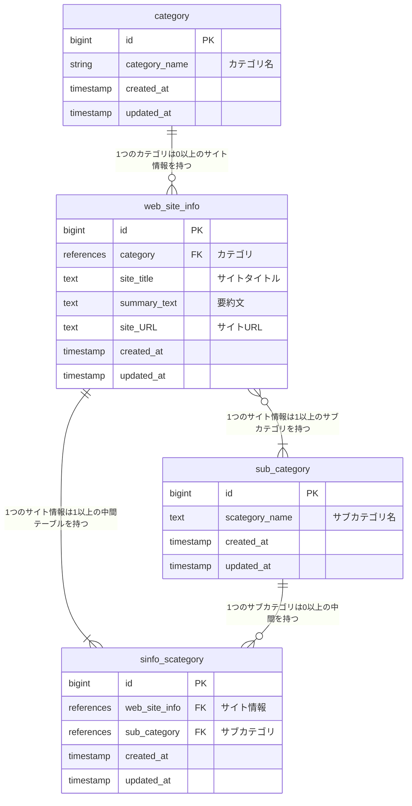
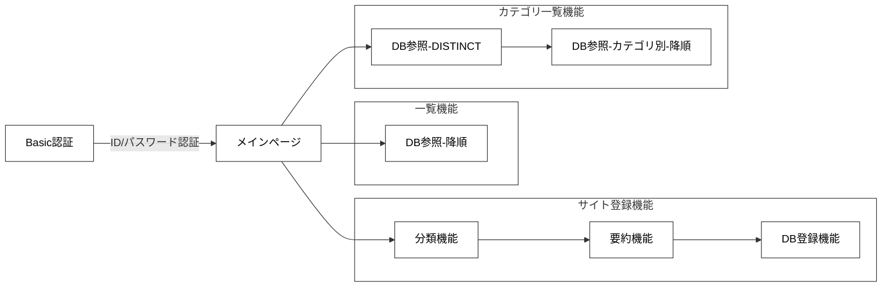

# README

## アプリケーション名
分類くん

## アプリケーション概要
ブックマークの代わりにお気に入りのサイトを登録することでchatGPTを使ったカテゴリ分けができます。

## URL
[分類くん](https://classification-app-jgcq.onrender.com)

## テスト用アカウント
* Basic認証ID：admin
* Basic認証パスワード：2222

## 利用方法
### お気入り登録
1. メニューバーの「お気入り登録」または「≡」をクリックし「お気入り登録」をクリックします。
2. 登録が完了すると一覧ページが表示されます。ここで枠の先頭に表示されているカテゴリとサブカテゴリを確認します。
### 一覧表示
1. メニューバーの「一覧」または「分類くん」をクリックします。
2. お気入り登録した情報が表示されます。
3. 「リンク先」ボタンをクリックすると、お気入り登録したサイトに訪れることができます。
### 分類一覧表示
1. メニューバーの「カテゴリ」をクリックします。
2. カテゴリの一覧が表示されます。
3. カテゴリの隣に展開ボタンがあるのでクリックすると、該当するお気入り登録した情報が表示されます。
4. 「リンク先」ボタンをクリックすると、お気入り登録したサイトに訪れることができます。

## アプリケーションを作成した背景
私がブックマークしたサイトを探すときに時間がかかっていました。ブラウザ機能を使いブックマークをフォルダ分けすれば自分の考えたカテゴリで分けることができますが、時間が惜しいと感じました。
そこでchatGPTを使えばサイトの要約やカテゴリ分けができることを知りました。サイトを登録することで自動的にカテゴリに分けれれば登録する時と探す時の時間が削減できると考え開発することにしました。

## 洗い出した要件
[要件を定義したシート](https://docs.google.com/spreadsheets/d/1w1WoIemOcRKStCd5c8KCZetGoOMtjfaK/edit?usp=drive_link&ouid=105502157449333505049&rtpof=true&sd=true)

## 実装予定機能
- ユーザー管理機能
- 分類編集機能
- 要約文編集機能
- サブカテゴリ編集機能
- サブカテゴリ検索機能

## ER図

## テーブル設計

### category（カテゴリ） テーブル

| Column             | Type    | Options     |
| ------------------ | ------- | ----------- |
| category_name      | string  | null: false |

#### Association

- has_many :web_site_info

### web_site_info（サイト情報） テーブル

| Column                   | Type       | Options     |
| ------------------------ | ---------- | ----------- |
| category                 | references | null: false, foreign_key: true |
| site_title               | text       | null: false |
| summary_text             | text       | null: false |
| site_URL                 | text       | null: false |

#### Association

- belongs_to :category
- has_many :sub_category, through: :sinfo_scategory
- has_many :sinfo_scategory

### sinfo_scategory（サイト情報とサブカテゴリの中間） テーブル

| Column        | Type       | Options                        |
| ------------- | ---------- | ------------------------------ |
| web_site_info | references | null: false, foreign_key: true |
| sub_category  | references | null: false, foreign_key: true |

#### Association

- belongs_to :web_site_info
- belongs_to :sub_category

### sub_category（サブカテゴリ） テーブル

| Column         | Type | Options     |
| -------------- | ---- | ----------- |
| scategory_name | text | null: false |

#### Association

- has_many :web_site_info, through: :sinfo_scategory
- has_many :sinfo_scategory

## 画面遷移図

## 開発環境
- フロントエンド：Bootstrap
- バックエンド：Ruby on Rails
- WebAPI：GPT-3.5-turbo-0125
- インフラ：Render.com
- テスト:Rspec
- テキストエディタ：VSCode
- タスク管理：GitHub

## 工夫したポイント
* 入力を減らすため、URLのみをユーザに入力させ登録できるようにしました。
* リンクが切れているサイトは登録しないようにバリデーションしました。
* カテゴリだけでは表示をした際に見る分量が増え、どれを開いたらよいのか迷うため、サブカテゴリを追加しました。
* すでに登録されてあるサイトを登録するときにバリデーションをするようにしました。
* 例外処理として、「その他」カテゴリを追加しました。
* 表示量が多くならないようにページ割りを行いました。
