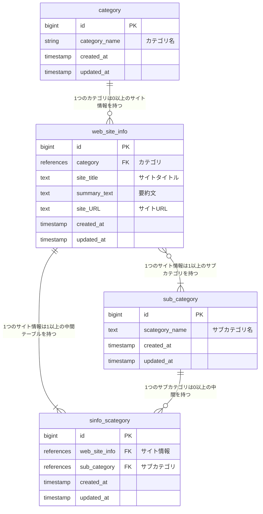

# README

## ER図

## テーブル設計

### category（カテゴリ） テーブル

| Column             | Type    | Options     |
| ------------------ | ------- | ----------- |
| category_name      | string  | null: false |

#### Association

- has_many :web_site_info

### web_site_info（サイト情報） テーブル

| Column                   | Type       | Options     |
| ------------------------ | ---------- | ----------- |
| category                 | references | null: false, foreign_key: true |
| site_title               | text       | null: false |
| summary_text             | text       | null: false |
| site_URL                 | text       | null: false |

#### Association

- belongs_to :category
- has_many :sub_category, through: :sinfo_scategory
- has_many :sinfo_scategory

### sinfo_scategory（サイト情報とサブカテゴリの中間） テーブル

| Column        | Type       | Options                        |
| ------------- | ---------- | ------------------------------ |
| web_site_info | references | null: false, foreign_key: true |
| sub_category  | references | null: false, foreign_key: true |

#### Association

- belongs_to :web_site_info
- belongs_to :sub_category

### sub_category（サブカテゴリ） テーブル

| Column         | Type | Options     |
| -------------- | ---- | ----------- |
| scategory_name | text | null: false |

#### Association

- has_many :web_site_info, through: :sinfo_scategory
- has_many :sinfo_scategory
